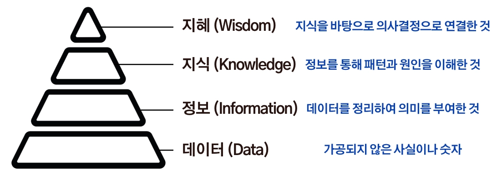

# CH01 (개발환경 구축)

## 📝 오늘 배운 내용 요약

1. 프로그래밍 언어 및 라이브러리와 프레임 워크 비교
- 파이썬(Python)
- **간결한 문법과 높은 가독성**을 추구하는 인터프리터 기반 프로그래밍 언어
- 장점
풍부한 라이브러리와 플랫폼 독립성을 바탕으로 **데이터 분석, 인공지능, 웹 개발, 자동화** 등 다양한 분야에서 활용되며, 생산성이 높고 학습이 쉬운 것이
- 한계점
인터프리터 방식과 GIL(Global Interpreter Lock) 등의 특성으로 **실행 속도가 컴파일 언어보다 느리고**, CPU 기반 병렬 처리에는 일부 한계가 있음
- Python VS C,Java
- **C :** 실행 속도가 가장 빠르고 시스템 프로그래밍에 적합
- **Java :** 안정성과 이식성이 뛰어나 대규모 백엔드 개발에 많이 사용
- **Python :** 실행 속도는 다소 느리지만 문법이 간단하고 개발 생산성이 높음
**NumPy·Pandas**(데이터 분석), **TensorFlow·PyTorch**(AI), **Django·Flask**(웹 개발) 등 다양한 라이브러리와 프레임워크를 제공해 폭넓은 개발 환경을 지원
2. 개발환경 설정/구글 코랩 
- **개발환경(IDE)**
- 코드를 작성·실행·디버깅·관리하는 작업 공간이다.
- Python 학습에서는 **Google Colab**, Jupyter Notebook, PyCharm 등이 주로 사용됨.
- **Google Colab**
- 웹 브라우저에서 사용하는 **클라우드 기반 Python 개발환경**
- Python과 주요 라이브러리가 기본 제공, **무료 GPU/TPU**를 지원 → 데이터 분석과 AI 학습에 적합함
- Google Drive 연동 및 협업 기능을 제공 학습과 프로젝트에 편리하다.
3. AI 개요
- AI, 머신러닝, 딥러닝
- **인공지능 (AI)
**사람처럼 사고·행동하는 시스템 전체를 가리키는 가장 넓은 개념. 규칙을 사람이 일일이 정해줬든, 스스로 학습했든 상관없이 전부 AI로 분류됨
- **머신러닝(ML)
**규칙을 사람이 정해주는 대신, 데이터를 잔뜩 보여주고 컴퓨터가 스스로 규칙(패턴)을 찾아내게 하는 방법
- 지도학습
: **정답(레이블)이 있는 데이터**를 학습하여 새로운 데이터의 결과를 예측하는 방식 → 예: 분류(Classification), 회귀(Regression)
- 비지도학습
: **정답 없이** 데이터의 패턴이나 그룹을 스스로 찾아내는 방식 → 예: 군집화(Clustering), 차원 축소
- 강화학습
:**보상과 벌점**을 통해 최적의 행동을 학습하는 방식 → 예: 게임 AI, 자율주행, 로봇 제어
- **딥러닝(DL)
**머신러닝 중에서도 사람 뇌의 신경세포(뉴런) 구조를 흉내 낸 “인공신경망”을 사용하는 방법. ChatGPT 같은 생성형 AI, 얼굴 인식 등이 대부분 여기에 해당
- **인공신경망(Neural Network)**을 이용해 데이터의 특징을 스스로 학습하여 높은 정확도로 예측하는 방식 → 예: 이미지 인식, 음성 인식, 자연어 처리, 생성형 AI
- 데이터 
- 데이터란?
'주어진 것'이라는 뜻에서 시작된 개념으로, **현실 세계에서 관찰하거나 측정한 사실(fact). 정보나 지식으로 가공되면 매우 가치 있는 자원이 됨.**

- **데이터 종류**
- **정형 데이터(Structured Data)**
: **행과 열(표) 형태로 구조화된 데이터**로 분석이 쉽고 머신러닝에서 가장 많이 사용됨 → 예: CSV, Excel, SQL
- **반정형 데이터(Semi-Structured Data)**
: **일정한 구조는 있지만 형식이 고정되지 않은 데이터** → 예: JSON, XML, HTML
- **비정형 데이터(Unstructured Data)**
: **정해진 구조가 없는 데이터**로 AI·딥러닝에서 많이 활용됨 → 예: 이미지, 영상, 음성, PDF, SNS 게시글
## 💭 오늘의 회고

1. **배운 점**
—

2. **어려운 점/개선할 점**
- 온라인에서 집중할 수 있을 환경 만들기
3. **액션 플랜**
환경 세팅 완료하기 2026-07-13T18:00:00.000+09:00 

- [x] ZEP (강의장)
- [x] Python
- [x] Google Colab
4. **함께 나누고 싶은 점**
—

## 🔍 내일 학습 예정

- 파이썬 기초 문법

