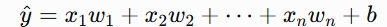
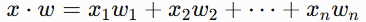
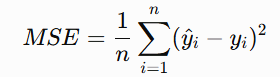
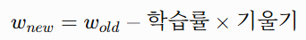

# CH11 (머신러닝 기초)

## 📝 오늘 배운 내용 요약

1-1. 머신러닝

머신러닝

`데이터(+정답 또는 보상) → 컴퓨터가 패턴 학습 → 규칙 = 모델 → 새 데이터 예측`

- 데이터 : 컴퓨터가 학습할 재료
- 특성 `X` : 예측에 사용하는 입력 데이터
- 타깃 `y` : 최종적으로 맞혀야 하는 정답
- 모델 : 컴퓨터가 데이터에서 찾아낸 규칙
- 예측 : 학습한 규칙을 새로운 데이터에 적용한 결과
※ `데이터 + 정답` 구조는 **지도학습**에 해당

※ 비지도학습은 정답 없이 학습 / 강화학습은 정답 대신 보상을 이용

1-2. 머신러닝의 종류

- 지도학습 : `특성 X + 정답 y → X와 y의 관계 학습` 
- 회귀 : 타깃이 **연속적인 숫자**

- 질문 : “얼마?”, “몇 개?”, “어느 정도?”
- ex) 매출액, 집값, 기온, 전세 보증금, 판매량
```plain text
집의 평수·층수·위치 → 전세 보증금 예측
```

- 분류

타깃이 **정해진 카테고리**

- 질문 : “어느 종류?”, “해당하는가?”
- 이진 분류 : 두 카테고리
- 다중 분류 : 세 개 이상의 카테고리
- ex) 스팸/정상, 이탈/잔류, 붓꽃 품종, 고양이/개/토끼
```plain text
방문 횟수 → 재방문 여부 예측
꽃잎 크기 → 붓꽃 품종 예측
```

※ 분류는 Yes/No만 의미하지 않음

※ “이탈 확률 82%”처럼 확률을 출력해도 최종 정답이 이탈/잔류라면 **분류**

- 비지도학습 :`특성 X만 존재 / 정답 y 없음 → 데이터 안의 구조와 패턴 탐색`
- 군집화 : 비슷한 데이터끼리 그룹화
- 차원 축소 : 많은 특성을 적은 수의 핵심 특성으로 압축
- 이상 탐지 : 일반적인 패턴에서 벗어난 데이터 탐색
- ex) 고객 유형 자동 그룹화, 상품 자동 분류, 이상 거래 탐지
```python
from sklearn.datasets import load_iris
from sklearn.cluster import KMeans

iris = load_iris(as_frame=True)

# 정답 iris.target을 사용하지 않고 특성만으로 그룹화
kmeans = KMeans(n_clusters=3, random_state=42, n_init=10)
clusters = kmeans.fit_predict(iris.data)
```

- 강화학습 : `상태 → 행동 → 보상 → 시행착오를 반복하며 보상을 최대화`
- 정답을 바로 알려주는 대신 행동 결과에 대한 보상을 제공
- ex) 게임 플레이, 로봇 제어, 자율주행, 추천 정책 최적화
1-3. 문제 유형 판단 기준

```plain text
행동에 따른 보상을 최대화하는 문제인가?
→ 강화학습

정답 y가 없는가?
→ 비지도학습

정답 y가 있는가?
→ 지도학습

정답이 연속적인 숫자인가?
→ 회귀

정답이 정해진 카테고리인가?
→ 분류
```

※ 타깃이 정수인지 소수인지보다 **그 값이 무엇을 의미하는지**로 판단

`0, 1, 2`가 품종 이름표라면 분류 / 판매 개수라면 회귀가 될 수 있음

1-4. 머신러닝 프로젝트 흐름

`문제 유형 판단 → 데이터 준비 → 데이터 분할 → 모델 학습 → 평가 → 새 데이터 예측`

1. 무엇을 예측할지 결정
2. 특성 `X`와 타깃 `y` 분리
3. 훈련·검증·테스트 데이터 분할
4. 훈련 데이터로 모델 학습
5. 처음 보는 데이터로 성능 평가
6. 새로운 데이터 예측
- 머신러닝
- 데이터 + 정답 → 컴퓨터(스스로 학습) → 규칙(컴퓨터가 스스로 찾아냄) = 모델(:데이터가 스스로 찾아낸 규칙)
- 지도(회귀/분류) / 비지도 (군집화/차원 축소) / 강화
- 지도 : 맞혀야할 타겟변수가 연속적인 숫자 / 정해진 카테고리
- 회귀 - ‘얼마?’를 묻는 문제 ex) 매출액,집값,기온,전세 보증금 등
- 분류 - ‘yes/no’를 묻는 문제 ex) 스팸/정상,붓꽃 품종,이탈여부 
- ML 프로젝트 흐름 : 문제 유형 판단 → 데이터 분할 → 모델 학습 → 평가
2-1. 선형 모델의 예측

- 선형 모델 기준


- `x` : 특성, 입력 데이터
- `w` : 가중치, 각 특성의 영향력
- `b` : 편향, 기본값을 보정하는 값
- `ŷ` : 모델의 예측값
- `y` : 실제 정답
- 선형 모델의 학습 : `데이터에 가장 잘 맞는 w와 b를 찾는 과정`
2-2. 벡터와 내적

- **벡터 : **여러 숫자를 순서대로 묶은 것
```python
x= [배달 건수,이동 거리]
w= [건당 수입,km당 수입]
```

- **내적 : **짝이 맞는 숫자끼리 곱한 뒤 전부 더하기


```python
import numpy as np

x = np.array([30, 120])       # 배달 30건, 이동거리 120km
w = np.array([3000, 100])     # 건당 3000원, km당 100원
b = 0

y_pred = x @ w + b
print(y_pred)                 # 102000
```

2-3. 손실 함수

- **손실 loss**
`예측값과 실제 정답이 얼마나 다른지 나타내는 값`

- 손실이 작을수록 좋은 모델
- 손실이 클수록 예측이 많이 틀림
- MSE (평균제곱오차)


- 예측값과 정답의 차이를 제곱
- 음수와 양수 오차가 서로 상쇄되지 않음
- 크게 틀린 예측에 더 큰 벌점 부여
- 회귀 문제에서 대표적으로 사용하는 손실 함수
```python
loss= ((y_pred-y)**2).mean()
```

2-4. 경사하강법

- **경사하강법**
`손실이 작아지는 방향으로 가중치를 조금씩 수정하는 방법`

```plain text
예측 → 손실 계산 → 기울기 확인 → 가중치 수정 → 반복
```

- 가중치 수정


- 기울기 `gradient` : 손실을 줄이려면 어느 방향으로 움직여야 하는지 알려주는 값
- 학습률 `learning rate` : 한 번에 얼마나 크게 수정할지 결정하는 값
```python
# 아래 코드는 예측값 자체를 수정하는 단순 예시
# 실제 선형 모델에서는 같은 원리로 `w`와 `b`를 수정

target = 170
guess = 150
learning_rate = 0.1

for step in range(5):
    gradient = 2 * (guess - target)
    guess = guess - learning_rate * gradient
    loss = (guess - target) ** 2

    print(
        f"{step + 1}스텝 | "
        f"예측: {guess:.1f} | "
        f"loss: {loss:.1f}"
    )
```

2-5. 학습률

- **학습률**
`가중치를 수정할 때의 보폭`

- 너무 작음 → 손실은 줄지만 학습 속도가 매우 느림
- 적절함 → 손실이 안정적으로 감소
- 너무 큼 → 최적값을 지나쳐 손실이 커질 수 있음
- 발산 `divergence` : 값이 목표에서 점점 멀어지는 현상
- 진동 : 목표값 양쪽을 반복하며 수렴하지 못하는 현상
- 학습 원리 핵심
`틀린 만큼 → 반대 방향으로 → 조금씩 수정`

3-1. 데이터를 나누는 이유

: 훈련 데이터로 학습한 뒤 같은 데이터로 평가하면 모델이 실제로 학습한 것인지, 단순히 외운 것인지 구분하기 어려움

- 훈련 데이터 점수만 높음 → 암기 또는 과적합 가능

-  처음 보는 데이터에서도 성능이 좋아야 실제 성능이 좋은 모델

- **과적합 : **훈련 데이터에는 지나치게 잘 맞지만 새로운 데이터에서는 성능이 낮은 상태
`훈련 점수 매우 높음 + 테스트 점수 낮음→ 과적합 가능성`

3-2. 데이터의 역할

- 훈련 데이터
- 모델이 규칙을 학습할 때 사용
- `model.fit(X_train, y_train)`
- 검증 데이터
- 모델 종류와 하이퍼파라미터를 비교할 때 사용
- 여러 번 성능을 확인하는 모의고사 역할
- ex) KNN의 `n_neighbors` 결정
- 테스트 데이터
- 최종 모델의 성능을 한 번 확인할 때 사용
- 모델 선택이나 튜닝에 반복 사용하지 않음
3-3. 상황별 분할 전략

- 일반적인 분류 문제
`무작위 분할 + 클래스 비율 유지`

```python
X_train,X_test,y_train,y_test=train_test_split(X,y,test_size=0.2,random_state=42,stratify=y)
```

- **stratify**
- 훈련·테스트 데이터가 원본과 비슷한 클래스 비율을 가지도록 분할
- 원본 90:10 → 훈련 90:10 / 테스트 90:10
※ 클래스를 50:50으로 만드는 기능이 아니라 **기존 비율을 유지하는 기능**

- 회귀 문제
- 타깃이 연속값이므로 일반적으로 `stratify` 사용 X
- 무작위 분할 사용
```python
X_train,X_test,y_train,y_test=train_test_split(X,y,test_size=0.2,random_state=42)
```

- 시계열 데이터 : 시간 순서가 있는 데이터
- ex) 월별 매출, 주가, 기온, 방문자 수
- 무작위로 섞지 않음 → 미래 데이터가 훈련에 들어가면 데이터 누수 발생하기 때문.
- 과거 데이터로 학습하고 미래 데이터로 평가
```python
split_point=int(len(data)*0.8)train=data.iloc[:split_point]# 과거 80%test=data.iloc[split_point:]# 최근 20%
```

- 하이퍼파라미터 튜닝 예정 
여러 설정을 비교해야 한다면 **훈련/검증/테스트 3분할**

```plain text
훈련 데이터 : 모델 학습
검증 데이터 : 설정 비교·튜닝
테스트 데이터 : 최종 평가
```

```python
#80% / 10% / 10% 분할
from sklearn.model_selection import train_test_split

# 1단계: 테스트 10% 분리
X_temp, X_test, y_temp, y_test = train_test_split(
    X,
    y,
    test_size=0.1,
    random_state=42,
    stratify=y
)

# 2단계: 남은 90%에서 전체의 10%에 해당하는 검증 데이터 분리
X_train, X_val, y_train, y_val = train_test_split(
    X_temp,
    y_temp,
    test_size=1/9,
    random_state=42,
    stratify=y_temp
)
```

`1/9`을 사용하는 이유

```plain text
전체의 90%가 남아 있음
전체의 10%를 검증 데이터로 만들려면
10 ÷ 90 = 1/9
```

3-4. 전체 머신러닝 흐름 코드

- 붓꽃의 꽃잎·꽃받침 크기로 품종을 맞히는 문제
- 타깃 : 세 가지 붓꽃 품종
- 문제 유형 : 다중 분류
- 분할 전략 : `stratify`를 적용한 무작위 분할
- 모델 : KNN
- 평가 지표 : 정확도
```python
from sklearn.datasets import load_iris
from sklearn.model_selection import train_test_split
from sklearn.neighbors import KNeighborsClassifier
from sklearn.metrics import accuracy_score
import pandas as pd

# 1. 데이터 준비
iris = load_iris(as_frame=True)
X = iris.data
y = iris.target

# 2. 데이터 분할
X_train, X_test, y_train, y_test = train_test_split(
    X,
    y,
    test_size=0.2,
    random_state=42,
    stratify=y
)

# 3. 모델 생성
model = KNeighborsClassifier(n_neighbors=3)

# 4. 모델 학습
model.fit(X_train, y_train)

# 5. 테스트 데이터 예측
pred = model.predict(X_test)

# 6. 성능 평가
accuracy = accuracy_score(y_test, pred)
print(f"정확도: {accuracy:.3f}")

# 7. 새로운 데이터 예측
new_flower = pd.DataFrame(
    [[5.1, 3.5, 1.4, 0.2]],
    columns=X.columns
)

new_pred = model.predict(new_flower)
print("예측 품종:", iris.target_names[new_pred[0]])
```

## 💭 오늘의 회고

1. **배운 점**
- 내적(dot product)
: 짝이 맞는 숫자끼리 곱해서 전부 더하는 연산. 선형 모델은 "특성 · 가중치" 내적으로 예측값을 계산함.

- 손실(loss)을 그냥 (예측 - 정답)이 아니라 제곱으로 정의하는 이유
: 그냥 예측 - 정답
→ 음수와 양수가 서로 상쇄될 수 있음

(예측 - 정답)²
→ 틀린 방향이 아니라 틀린 정도를 계산하기 위해
→ 여러 오차가 서로 상쇄되는 것을 막기 위해
→ 큰 오차를 더 크게 반영하기 위해

- 기울기(gradient)가 음수로 나왔다면 예측이 정답보다 작다는 뜻이므로 예측값을 키워야 함. 경사하강법은 항상 "기울기의 반대 방향"(내리막길)으로 이동하므로, 음수 기울기 → 예측 증가가 됨.
- 학습률이 너무 큼
→ 가중치를 한 번에 지나치게 많이 수정

→ 손실이 가장 작은 지점을 계속 지나침

→ 예측이 점점 불안정해지고 손실이 커짐

= 발산

- 회귀 = "숫자를 찍는" 문제 / 분류 = "칸을 고르는" 문제
2. **어려운 점/개선할 점**
- ㅡ


3. **액션 플랜**
- [x] 머신러닝 기초
- [x] 머신러닝 분류
- [x] 데이터 분할


4. **함께 나누고 싶은 점**
- ㅡ
## 📚 참고자료

- ㅡ


## 🔍 내일 학습 예정

- CH 12 (회귀와 분류)